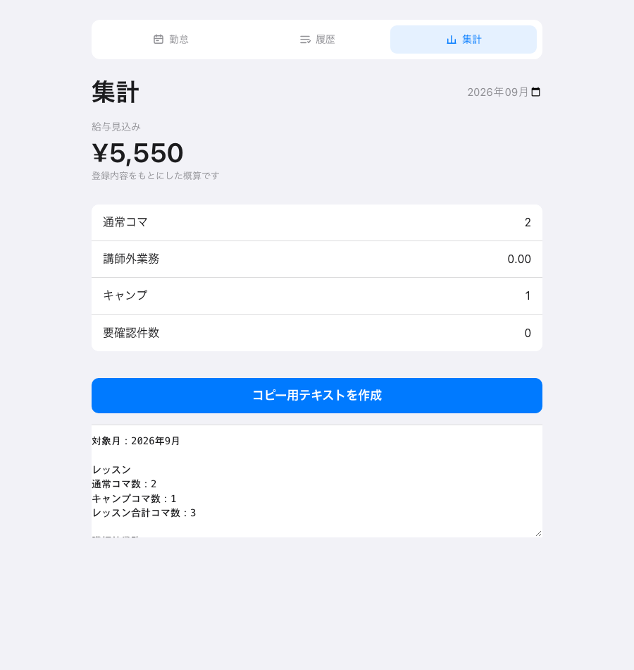

# 勤怠・請求メモのセットアップ

Googleアカウントと、このリポジトリにある `Code.gs`、`Index.html` を使用します。

## 1. スプレッドシートを作成する

1. [Googleスプレッドシート](https://sheets.google.com/)を開きます。
2. 空白のスプレッドシートを新しく作成します。
3. 必要に応じて、スプレッドシートの名前を `勤怠管理` に変更します。

スプレッドシートの名前は処理には使用しないため、`勤怠管理` に変更しなくても問題ありません。分かりやすく管理するための任意の名前です。

## 2. Apps Scriptにコードを登録する

1. スプレッドシート上部の `拡張機能` → `Apps Script` を開きます。
2. 最初からある `Code.gs` の内容をすべて削除します。
3. このリポジトリの `Code.gs` の内容を貼り付けます。
4. 左側の `＋` → `HTML` を選び、ファイル名を `Index` にして作成します。
5. 作成した `Index.html` の内容をすべて削除します。
6. このリポジトリの `Index.html` の内容を貼り付けます。
7. 保存します。

## 3. 初期設定を実行する

1. Apps Script画面上部の関数選択で `setup` を選びます。
2. `実行` を押します。
3. 権限の確認が表示されたら、使用するGoogleアカウントを選んで許可します。
4. スプレッドシートに `勤怠ログ` と `月次集計` の2つのシートが作成されたことを確認します。

## 4. Webアプリとして公開する

1. Apps Script画面右上の `デプロイ` → `新しいデプロイ` を選びます。
2. `種類の選択`で `ウェブアプリ` を選びます。
3. `次のユーザーとして実行`を `自分` にします。
4. `アクセスできるユーザー`を、利用する人に合わせて選びます。
5. `デプロイ`を押します。
6. 権限の確認が表示された場合は、画面に従って許可します。
7. 表示されたウェブアプリのURLを開き、画面が表示されればセットアップ完了です。

ウェブアプリのURLは、実際に利用する端末で開けるようにブックマークしておくと便利です。

## 月末の報告文を作成する

1. Webアプリを開き、`集計` タブを選びます。
2. 画面上部で、報告する対象月を選びます。
3. コマ数、講師外業務の時間、要確認件数に間違いがないか確認します。
4. 修正が必要な場合は、`履歴` タブで対象の勤務実績を修正してから、もう一度 `集計` タブを開きます。
5. `コピー用テキストを作成` を押します。
6. 月末報告用の文章が自動でコピーされるので、報告先のメッセージやフォームに貼り付けます。

ブラウザの制限で自動コピーされなかった場合は、画面に表示された文章を選択してコピーしてください。

## 設定を変更したい場合

設定を変更したら、Apps Scriptのコードを貼り替えて、もう一度デプロイしてください。

以下の行番号は、現在のコードでの目安です。コードを編集すると行番号が変わる場合があります。

### クラスの種類を変更する

`Code.gs` の1〜46行目にある `COURSE_CONFIG` で変更します。

例えば、使用しない `CB` を選択肢から消す場合は、次の3か所から `CB` の行を削除します。

- `lessonContentOptions`（2〜14行目）
- `lessonBillingRules`（15〜27行目）
- `lessonContentLabels`（28〜40行目）

クラスを追加する場合は、同じ3か所すべてに追加してください。

### 単価を変更する

`Code.gs` の `APP_CONFIG` にある次の行を変更します。

- `lessonPayPerKoma`（78行目）: 通常の講師業務1コマあたりの単価
- `campLessonPayPerKoma`（79行目）: キャンプ1コマあたりの単価
- `workHourlyPay`（80行目）: 講師外業務の時給

現在の設定は、通常の講師業務が1コマ1,800円、キャンプが1コマ1,950円、講師外業務が時給1,226円です。
